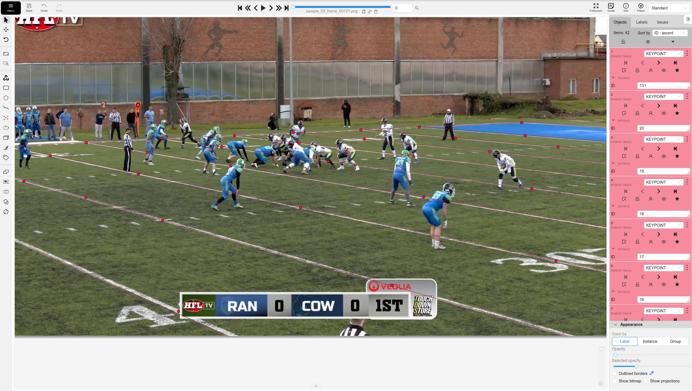
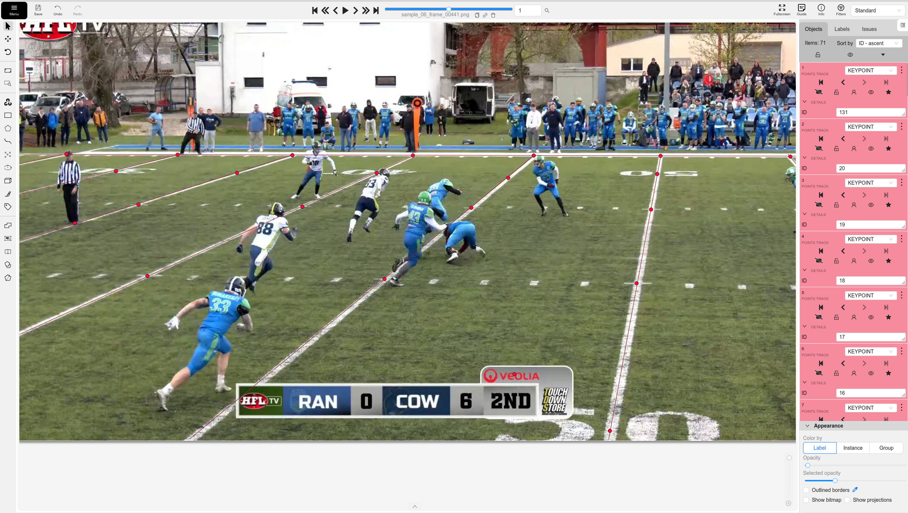
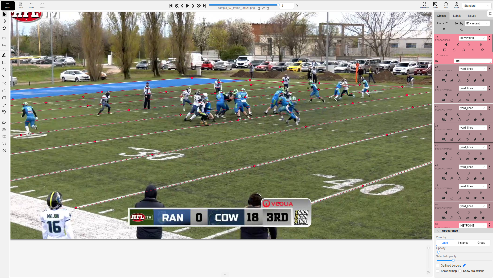

# American Football Field Annotation — CVAT

## Overview

Computer vision annotation task performed in CVAT.

The goal was to annotate field landmarks across multiple frames of an American football video.

## Annotation Types

### Keypoints

Field landmarks were annotated using the `KEYPOINT` class.

Each point was assigned an ID according to a predefined numbered field schema.

### Yard Lines

Visible field lines were annotated using the `yard_lines` class.

Lines were aligned with the actual visible field markings.

## Work Performed

- Reviewed existing pre-annotations
- Checked keypoint placement
- Validated keypoint IDs against the field schema
- Corrected incorrectly propagated tracks
- Worked with track keyframes
- Used the Outside state to stop tracks from appearing in later frames
- Checked annotation consistency across frames
- Performed final quality control

## Tools and Concepts

- CVAT
- Point Tracks
- Polyline Tracks
- Keyframes
- Track interpolation
- Outside state
- Annotation QA
- ID validation

## Result

Three frames were reviewed and corrected according to the annotation guidelines.

## Screenshots

### Frame 0

### Frame 1

### Frame 2

